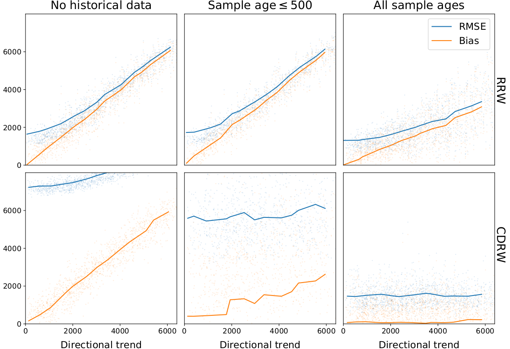
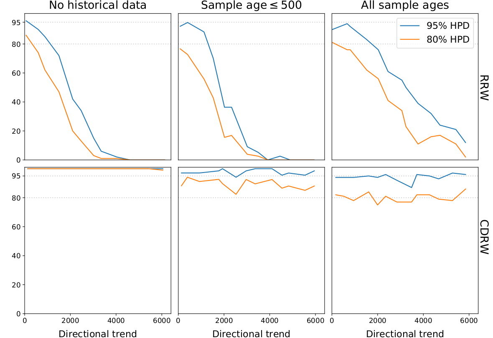
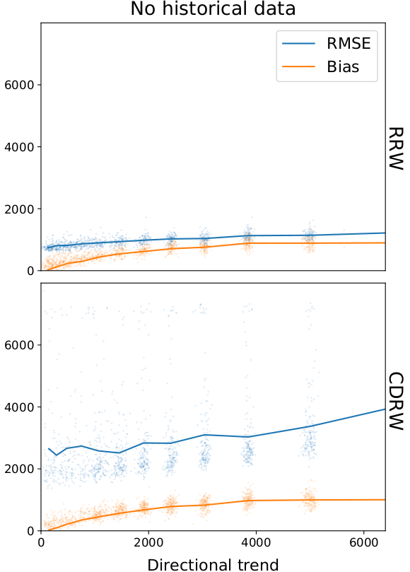
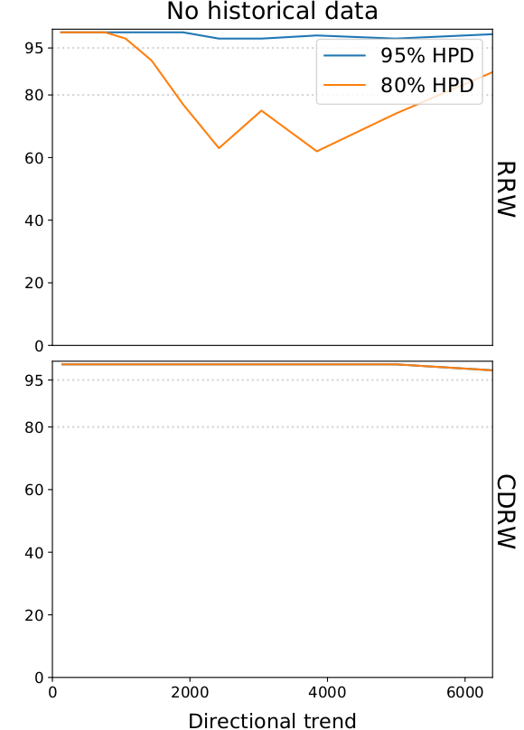

# Can Bayesian phylogeography reconstruct migrations and expansions in human history?
This repository contains the scripts for the simulation, reconstruction and evaluation presented in our paper "Can Bayesian phylogeography reconstruct migrations and expansions in human history?" (Neureiter N., Ranacher P., Van Gijn R., Bickel B., Weibel R., forthcoming). Below we briefly describe the goals of the study and the necessary steps to reproduce the experiments.

## Study summary
In this study we want to evaluate the performance of Bayesian phylogeographic methods under two movement scenarios (i.e. spatio-temporal processes). In the paper we call these processes migration and expansion, which are implemented here in the form of directional random walks and a grid-based region-growing process respectively (to be found in `src/simulation/migration_simulation.py` and `src/simulation/expansion_simulation.py`). We simulate migrations and expansions under varying degrees of directional trends, attempt to reconstruct the root location based on the simulated phylogeny and tip locations and evaluate the reconstructed root.

## Requirements
The required python packages are listed in the requirements.txt (and can be installed via `pip3 install -r requirements.txt`). This should be sufficient to run the simulations provided in this package. In order to perform and evaluate a phylogenetic reconstruction (as we do in the experiments), an installation of BEAST 1 is required. You can find the free download and set-up instructions on the BEAST 1 website: [https://beast.community/]. In order to run our experiment scripts, the `beast` command and the `treeannotator` command need to be defined in the environment variable (alternatively, you can adapt the scripts in `src/beast_scripts/`).

## Experiment instructions
The main results of our study were presented in four plots (Figure 2 and 3 in the article). Here we explain how to reproduce them one-by-one.

### Migration simulations (directional random walks)
In `src/simulation/migration_simulation.py` we implement phylogeographic simulations, where the phylogenetic tree is generated by a common birth-death process and the geographic movements follow a directional random walk.
The simulation can be parameterized by the number of steps, the birth rate, the step variance, the directional bias, etc.
The script in `src/experiments/experiments_migration.py` defines a "migration simulation" experiment using the parameter values described in [1]. The parameter we are most interested in is the directional trend (or bias).
We vary the trend from 0 (undirectional random walk) to 6000 (three standard deviations of the random movement component).
The experiment script takes command line arguments, defining:
1) The movement model used in the reconstruction ('rrw' [default], 'cdrw', 'rdrw').
2) The maximum sample age. The default is 0 (i.e. only contemporary samples). To allow arbitrary sample ages, set it to 'inf'.
3) The number of runs. The default is 100.
4) The expected number of leaves in the simulated trees. The defaults is 100.
The results of the experiments are stored in a CSV file in an automatically generated folder at `experiments/random_walk/{mm}_treesize={treesize}_fossils={max_age}/` (e.g. `experiments/random_walk/rrw_treesize=100_fossils=0/` with standard settings).
We can plot these results using the visualization script in `src/visualization/plot_experiments.py`. Running the migration experiment with a maximum sample age of 0, 500 and 'inf' and varying the total directional trend between 0 and 6000 yielded the following results (Figure 3a):

And the corresponding HPD coverage values, plotted with the script (Figure 3b):

### Expansion simulations (region-growing process)
In addition to the simple and well known random walk model we implemented a grid-based region-growing process (expansions).
The expansion experiments are implemented according to the same structure as the migration experiments:
The simulation is implemented in `src/simulation/expansion_simulation.py`,
the experiment script can be found in `src/experiments/experiment_expansion.py` and
the results can be plotted using the same visualization script (`src/experiments/plot_experiment_results.py`).
Running and plotting the experiments with varying degrees of directional trend yields the following errors (Figure 4a):

And the corresponding HPD coverage values, plotted with the script (Figure 4b):

#
[1] Neureiter N., Ranacher P., Van Gijn R., Bickel B., Weibel R., *Can Bayesian phylogeography reconstruct migrations and expansions in human history?*, forthcoming